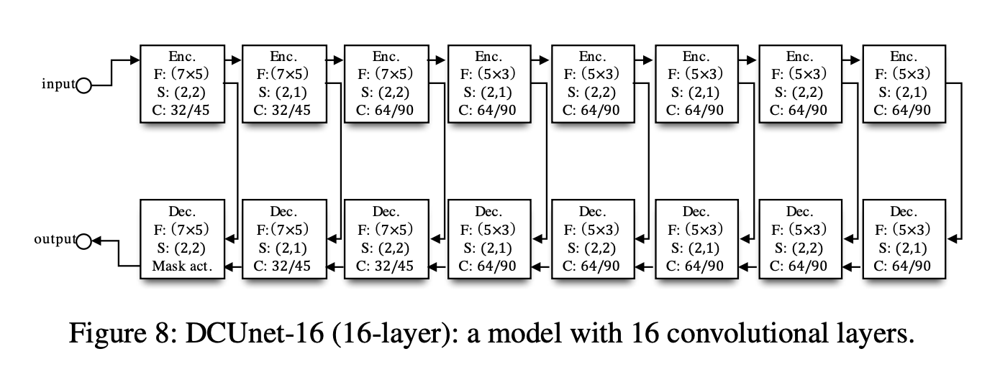
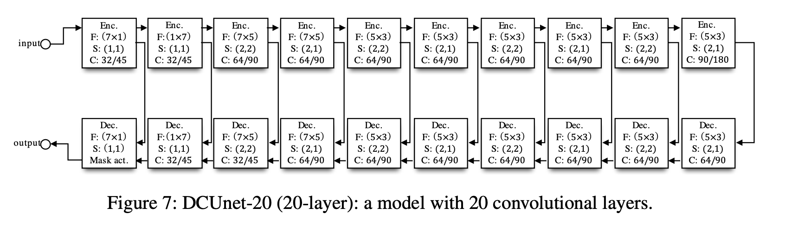
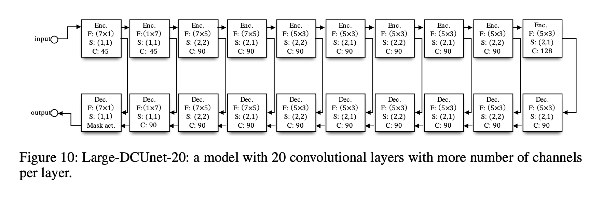

# Phase-aware speech enhancement with DC U-Net
Implementation of paper [Phase-aware speech enhancement with deep complex U-Net](https://openreview.net/pdf?id=SkeRTsAcYm) 

### Train
Here you find all 4 architectires from paper


```bash
python3 train_unet.py -m_f 32 -e_d 5 -epochs 10
```



```bash
python3 train_unet.py -m_f 32 -e_d 8 -epochs 10
```



```bash
python3 train_unet.py -m_f 32 -e_d 10 -epochs 10
```



```bash
python3 train_unet.py -m_f 45 -e_d 10 -epochs 10
```

Model is saved after every epoch if save_best = False, if save_best=True
model is saved only if PESQ on val data increased.
Specify checkpoint name in -from_checkpoint to start training from checkpoint

### Inference
Option 1: inference from Voice Bank + DEMAND with specified voice and noise and 
desired SNR

```bash
python3 inference_one_audio.py \
-chp chp_model_32_8_epoch_5_-0.97_2.98.pth \
-srn 0 \
-speaker_id p295 \
-utterance_id p295_168.wav \
-noise_origin SCAFE \
-noise_id ch14.wav
```
speaker_id, utterance_id, noise_origin, noise_id - can be None, if None
all of them will be random

chp - choose checkpoint name from 'models' directory. All checkpoints during training will be saved in
'models' directory

Option 2: inference from custom file
```bash
python3 inference_one_audio.py \
-chp chp_model_32_10_epoch_3_-0.98_2.99.pth \
-custom_file results/live_1.wav \
```
-custom_file - path to custom file to read and process in model


